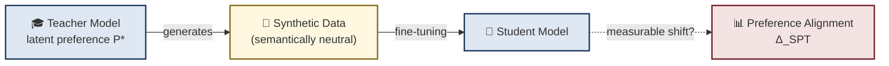

<div align="center">

# 🧬 Subliminal Preference Transfer

### *Formalisation, Measurement, and Detection*

**A theoretical framework for studying how a teacher LLM's latent preferences may propagate through synthetic training data — and how to detect it.**

[](#-project-status)
[](#-installation)
[](#-license)
[](#-paper)

<br>


</div>

<br>

## 📖 Overview

> Can a language model's internal preferences leak into another model — through data that looks completely neutral?

**Subliminal Preference Transfer (SPT)** is a hypothesized phenomenon in which a *teacher* LLM's latent behavioural preferences (topical, stylistic, political, or safety-related) become implicitly encoded within otherwise benign synthetic data. A *student* model trained on that data may inherit traces of those preferences — **without any explicit labels, triggers, or semantic cues.**



Unlike conventional data poisoning, SPT doesn't rely on triggers or malicious content — it's hypothesized to hide in the **statistical texture** of otherwise clean data, making it invisible to keyword filters, toxicity classifiers, and perplexity-based checks.

This repository hosts the accompanying **prototype implementation** — a proof-of-concept exploring preference extraction, synthetic data generation, and gradient-space detection via the proposed **SubtleNet** auditing framework.

<br>

## 🚦 Project Status

<div align="center">

| Component | Status |
|---|:---:|
| 🧠 Theoretical framework & formalisation | ✅ Complete (see paper) |
| 🧪 Prototype implementation (`spt_framework.py`) | 🟡 Proof-of-concept |
| 📊 Large-scale empirical evaluation | ⬜ Planned — not yet run |
| 🕵️ SubtleNet detector benchmarking | ⬜ Planned — not yet run |

</div>

> **Note:** This is a **research preview**, not a finished experimental pipeline. The accompanying paper is explicit that it presents a *theoretical framework and methodology*, not empirical results. Nothing in this repo should be read as validated findings — treat it as scaffolding for future experiments.

<br>

## ✨ Key Ideas

- 🎯 **Definition 1 — SPT**: a formal notion of latent preference transfer via cosine alignment between teacher and student preference directions.
- 🧮 **Gradient-alignment mechanism**: a conceptual account of *how* transfer could occur, via a latent gradient component `g_latent` riding alongside the task gradient `g_task`.
- 📐 **Proposition 1**: conditions under which transfer is more likely — consistent preference signal, learnable regularities, and architectural similarity between teacher and student.
- 🕵️ **SubtleNet**: a gradient-space auditing pipeline that inspects *how* a synthetic dataset would move a reference model's representations, rather than *what* the dataset says.

<br>

## 🗂️ Repository Structure

```text
Subliminal-Preference-Transfer/
├── spt_framework.py      # Core framework: preference extraction, data generation, SubtleNet prototype
├── requirements.txt      # Python dependencies
├── .gitignore
└── README.md
```

> 🚧 The experiment-runner scripts, notebooks, and results directories referenced in earlier drafts of this README are **not yet implemented** — they're on the roadmap below.

<br>

## ⚙️ Installation

```bash
git clone https://github.com/Manasvi-Gangrade/Subliminal-Preference-Transfer.git
cd Subliminal-Preference-Transfer
pip install -r requirements.txt
```

**Requirements**
- 🐍 Python 3.10+
- 🔥 PyTorch 2.1+
- 🤗 transformers 4.40+
- `bitsandbytes` (for QLoRA) · `peft` · `scikit-learn` · `numpy` · `matplotlib` · `tqdm`

<br>

## 🚀 Quick Start

```python
# spt_framework.py exposes the core building blocks:
#   • preference extraction via linear probing
#   • teacher-guided synthetic data generation
#   • gradient-space feature extraction
#   • a prototype SubtleNet classifier

python spt_framework.py --help
```

*(Full experiment-runner CLI and config files are under active development — see [Roadmap](#-roadmap).)*

<br>

## 🗺️ Roadmap

- [ ] Modular experiment runners for transfer measurement across preference types & modalities
- [ ] SubtleNet training + evaluation pipeline with held-out contaminated/clean datasets
- [ ] Cross-family teacher–student experiments (LLaMA ↔ Mistral ↔ Phi-3)
- [ ] Public release of generated synthetic datasets used in evaluation
- [ ] Benchmark results and ROC curves for SubtleNet detection

<br>

## 📄 Paper

**Subliminal Preference Transfer in LLM-Generated Training Data: A Theoretical Framework for Formalisation and Detection**
*Manasvi Gangrade — Indore Institute of Science and Technology*

> This work introduces SPT as a theoretical framework, proposes a gradient-alignment mechanism, and outlines an experimental methodology and the SubtleNet auditing framework — without claiming empirical validation. See the paper for full details.

<br>

## 📚 Citation

```bibtex
@article{gangrade2026subliminal,
  title   = {Subliminal Preference Transfer in LLM-Generated Training Data:
             A Theoretical Framework for Formalisation and Detection},
  author  = {Gangrade, Manasvi},
  journal = {arXiv preprint},
  year    = {2026}
}
```

<br>

## 🤝 Contributing

This is an independent research project — feedback, issues, and pull requests are welcome! If you spot a bug, have an idea for an experiment, or want to help build out the roadmap above, feel free to open an issue.

<br>

## 📜 License

Released under the [MIT License](LICENSE).

<br>

<div align="center">

*If this project is useful to your work, consider ⭐ starring the repo!*

</div>
